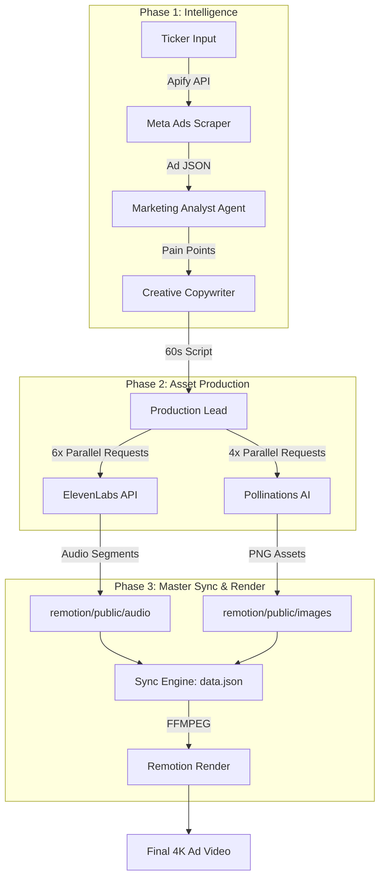

# 🚀 CW-Trading: Agentic Ad Production Engine

An automated, agent-driven pipeline that transforms real-time trading data into high-converting, perfectly synced video ads. Built with **CrewAI**, **Remotion**, and **ElevenLabs**.

## 📊 Detailed System Architecture

### Agentic Workflow


### 🛰️ Backend Request Lifecycle

1.  **OpenRouter (LLM)**: Orchestrates the reasoning. Every agent "thought" is a stateful POST request to the Gemini 2.0 Flash model, ensuring the script is data-driven and psychologically optimized.
2.  **ElevenLabs (TTS)**: The pipeline breaks the script into **6 distinct sentences**. Each is sent as a standalone request to the `v1/text-to-speech` endpoint. This allows us to calculate exact durations and prevent "audio drift" where the voice finishes before the text.
3.  **Pollinations AI (Visuals)**: Uses the **Flux** model to generate images. The pipeline sends 4 concurrent requests with unique seeds to ensure visual variety. If a request times out, the system implements a **Soft-Fail** mechanism, pulling from a local cache or a high-quality fallback.
4.  **Remotion Engine**: A React-based rendering process that uses **Puppeteer** to capture frames. It pulls the local `data.json` and stitches the 6 audio segments and 4 images into a seamless MP4 using **FFMPEG**.

## 💎 Key Features

-   **Master Sync System**: Generates audio in 6 individual segments to guarantee 100% perfect alignment between voice-over and on-screen text.
-   **Resilient Visuals**: Integrated with a robust AI image generator that handles timeouts and API failures gracefully with automatic fallbacks.
-   **Natural Language Processing**: Automatically spells out complex numbers and symbols (e.g., "$145" → "one hundred and forty-five dollars") for natural AI speech and predictable timing.
-   **Portrait Optimized**: Outputs 1080x1920 videos, perfect for mobile ads, TikTok, and Instagram Reels.

## 🛠 Tech Stack

-   **Orchestration**: CrewAI
-   **LLM**: Gemini 2.0 Flash (via OpenRouter)
-   **Video Engine**: Remotion (React + TypeScript)
-   **Voice**: ElevenLabs (Multilingual V2)
-   **Images**: Pollinations AI / Flux

## ⚙️ Setup

1.  **Install Dependencies**:
    ```bash
    pip install -r requirements.txt
    cd remotion && npm install
    ```
2.  **Configure `.env`**:
    Add your API keys to the `.env` file:
    -   `OPENROUTER_API_KEY`
    -   `ELEVENLABS_API_KEY`
    -   `APIFY_API_TOKEN`

## 🏃 Running the Pipeline

To generate a new ad from start to finish with live progress tracking:

```bash
python unified_pipeline.py

---
*Built with precision for the modern trader.*
